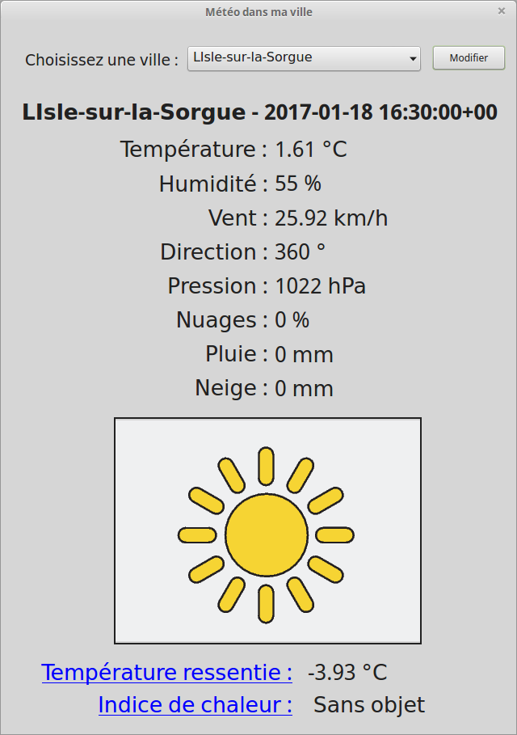

# openWeatherMap
Projet La météo dans ma ville - utilise openweathermap api

[openweathermap](http://openweathermap.org/ "http://openweathermap.org/")

* HIM réalisée avec Qt Designer
* Code en python repose sur l'utilisation de l'API pyowm [pyowm documentation](https://media.readthedocs.org/pdf/pyowm/latest/pyowm.pdf "https://media.readthedocs.org/pdf/pyowm/latest/pyowm.pdf")

1. Obtenir une clé API sur [openweathermap](http://openweathermap.org/ "http://openweathermap.org/")

2. installer pyowm : 
```sh
$ sudo pip install pyowm
```

3. Ouvrir openWeather.ui avec Qt Designer pour modifier l'IHM

4. transformer .ui en .py : 
```sh
$ pyuic4 -x openWeather.ui -o openWeatherGUI.py
```
Remarque : installation pyuic4 et Qt Designer : 
```sh
$ sudo apt-get install pyqt4-dev-tools qt4-designer
```

5. Ouvrir openWeather.py et adapter

6. Exécuter : 
```sh
$ python openWeather.py
```




